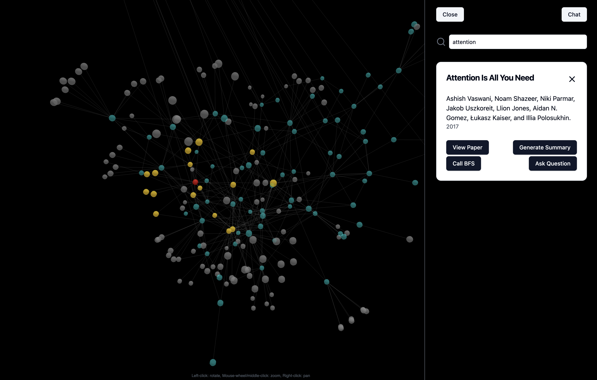

# Motivation:
Gaining an understanding of research litterature in a specific domain demands time and effort. This project is my attempt to use graphing technology and llms to create a tool for exploration and understanding of research papers.

# Capabilities:
- Visualization of data in a Neo4j database using [3D-Force-Graph](https://github.com/vasturiano/3d-force-graph) in React.

- Access to an llm for question answering with regards to papers in mind. 

- Automated extraction and addition of further papers to the database through an automated extraction process using [AI-SDK](https://github.com/vercel/ai).

# Setup:

